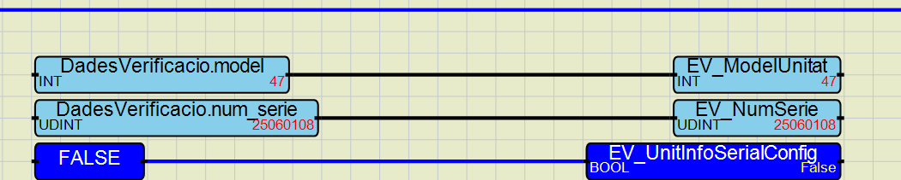

### RELEASE 27/06/2025 v2.9.1 (VERIFICADOR AUTOMATICO)  
```
CSUITE (CAREL) 
```
- **Pruebas:** *Seguridad Alta Presión (Transductor) y Seguridad Alta Presión (Presostato)*
  - [x] [MOD]: Modificado el valor de la variable `presionRearmeAltaPresion`. Valor antiguo 17 bar --> Nuevo valor 19 bar. ahora se requiere que la presión sea menor a 19 bar para pasar la prueba una vez ha ocurrido la alarma. La variable afectada es `presionRearmeAltaPresion`. 

  >**Observaciones**:  
  Con temperatura exterior mayor a 29º, la presión de descarga no baja de 18 bar una vez ocurrida la alarma, esto causa que la prueba se alargue en el tiempo más de lo necesario, incluso que no pase la prueba y el encargado de llevar la verificación desconecte el transductor para dar la prueba como valida.
  ##
- **Pruebas:** *Funcionamiento en modo frío y Funcionamiento en modo calor*
  - [x] [FIX]: Se elimina de la lógica de la prueba el valor de RPS mínimas para pasar la prueba. Ahora se comprueba que el equipo tanto en modo frío cómo en modo calor, dé la prueba como válida una vez superado el minimo tiempo de funcionamiento en ON.
  >**Observaciones**:  
  En epoca estival, donde las temperaturas exteriores son altas y el equipo funcionando en modo calor, las condiciones de trabajo son muy favorables, por lo que el equipo alcanza las RPS mínimas de manera rápida, incluso antes de alcanzar el tiempo mínimo de funcionamiento. Esto causa que la prueba se alargue en el tiempo más de lo necesario, incluso que no pase la prueba debido a que execede el tiempo máximo de validación de la prueba.
  ##

Primer equipo verificado con versión 2.9.1: 
- NS: **925060108**

